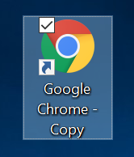
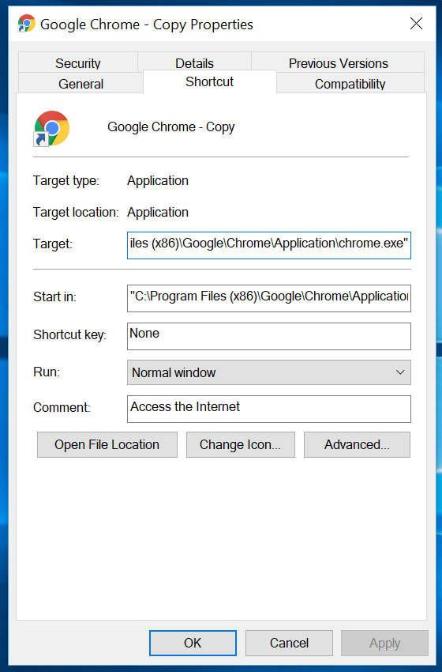
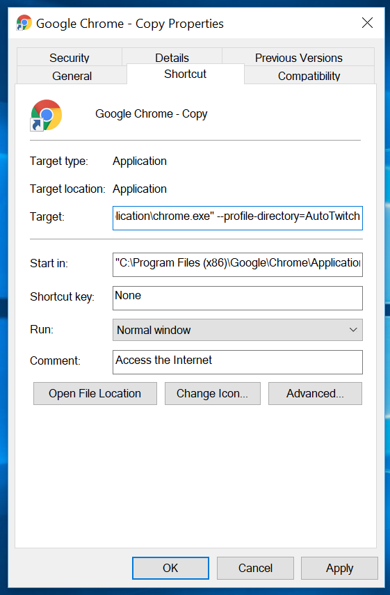

# Setup
## Basic
{Install button here}
1. Install the extension.

## Isolated
This is for if you want your Warframe windows seperated from the rest of your chrome windows.
1. Make a new shortcut to chrome on your desktop.

2. Open properties of shortcut.

3. Append `--profile-directory=AutoTwitch` to the Target text box.

4. Press apply.
4. Run the shortcut, open this page in the new window, and install the extension.

# Running
1. Open a new window. Use the custom shortcut if you did the isolated section.
2. Go to [https://kylewill0725.github.io/blank.html?start](https://kylewill0725.github.io/blank.html?start) to start the script.

3. When done, just close the window.